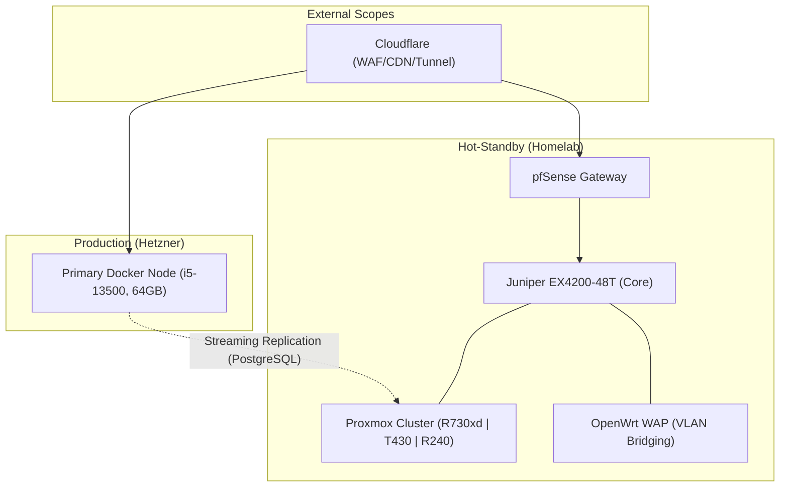

# sysadmin @ labontese <!-- 👋 -->

Infrastructure Architect and Developer focused on high-availability, hybrid-cloud environments, and regulatory-compliant software ecosystems. I manage a geo-redundant infrastructure across Hetzner (Production) and a sophisticated Homelab (Hot-Standby).

## 📡 Enterprise Networking & Infrastructure
A comprehensive L2/L3 environment leveraging 10G SFP+ backbones and advanced 802.1Q segmentation.

### 🏗️ Global Architecture

### ⚡ Technical Specifications
- **Core Switching**: Juniper EX4200-48T (48x 1GbE, 2x 10GbE SFP+ DAC)
- **Virtualization**: Multi-node Proxmox VE Cluster with Proxmox Backup Server (PBS) integration.
- **VLAN Matrix**:
    - `VLAN 1`: Management (Native)
    - `VLAN 10`: Enterprise Servers (Proxmox, TrueNAS)
    - `VLAN 20/30/40`: Segmented Client & Service Tiers
    - `VLAN 50/70/80`: Infrastructure & Lab Scopes
    - `VLAN 60/65`: Secure Trusted Users & Guest Access
    - `VLAN 90`: Isolated Corporate Infra (HolmDigital)
- **Compute Stack**: K3s Kubernetes Cluster, dedicated Docker hosts, and n8n workflow engines.

## 🛠️ Enterprise Software Stack
- **Observability**: GLOV Stack (VictoriaMetrics, Grafana, Loki, Grafana Alloy) for full-stack telemetry.
- **Security & IAM**: Wazuh (SIEM/XDR), OpenLDAP (Directory Services).
- **Automation**: Ansible-based IaC, tailored PowerShell routing scripts (VPN bypass logic).
- **IPAM**: Centralized management via phpIPAM.
- **Version Control**: Self-hosted Forgejo instance.

## 📊 Stats & Activity

---
