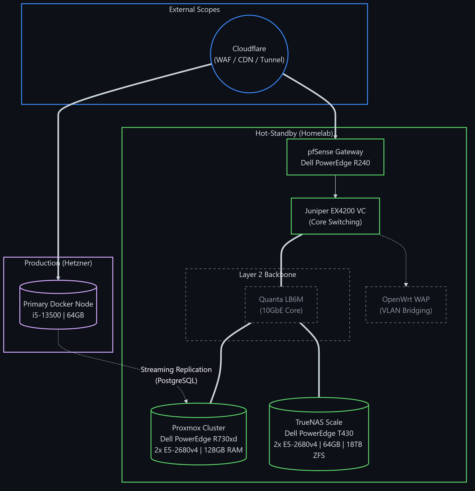

  

 

<table>
  <tr>
    <td valign="top" width="50%">
      <h3>🛠️ Core Modules (Tech Stack)</h3>
      

        
      

    </td>
    <td valign="top" width="50%">
      <h3>📊 Traffic Analysis (Status)</h3>
      

        
      

    </td>
  </tr>
</table>

### 🏗️ Architected Ecosystem (@holmdigital)
*Lead Architect & Developer for the [HolmDigital A11y Suite](https://github.com/holmdigital/a11y-hd).*

| Package | Role | Tech Stack | Distribution |
| :--- | :--- | :--- | :--- |
| **[`@holmdigital/engine`](https://www.npmjs.com/package/@holmdigital/engine)** | 🧠 **Architect** |  |  |
| **[`@holmdigital/components`](https://www.npmjs.com/package/@holmdigital/components)** | 🎨 **Lead Dev** |  |  |
| **[`@holmdigital/standards`](https://www.npmjs.com/package/@holmdigital/standards)** | ⚖️ **Maintainer** |  |  |

 

### 🏛️ Governance & Operations
> **Lead Developer** @ [`github.com/holmdigital`](https://github.com/holmdigital)  
> *Orchestrating the sovereign cloud initiative and open standards.*

 

<b>📋 View Infrastructure Logs (Network Topology & Specs)</b>

 

## Enterprise Networking & Infrastructure
A comprehensive L2/L3 environment leveraging 10G SFP+ backbones and advanced 802.1Q segmentation.

### 🏗️ Global Architecture

### ⚡ Technical Specifications
- **Core Switching**:   (24x 10GbE SFP+)
- **Virtualization**:  with 
- **VLAN Matrix**:
    - `VLAN 1`: Management (Native)
    - `VLAN 10`: Enterprise Servers (Proxmox, TrueNAS)
    - `VLAN 20/30/40`: Segmented Client & Service Tiers
    - `VLAN 50/70/80`: Infrastructure & Lab Scopes
    - `VLAN 60/65`: Secure Trusted Users & Guest Access
    - `VLAN 90`: Isolated Corporate Infra (HolmDigital)
- **Compute Stack**:  

## 🛠️ Enterprise Software Stack
- **Observability**:  (VictoriaMetrics, Loki, Alloy)
- **Security & IAM**:  
- **Automation**:  
- **IPAM**: 
- **Version Control**: 

  

