# tech-visionary @ labontese <!-- 👋 -->

Chief Innovation Architect and Developer focused on high-availability, hybrid-infrastructure environments, and regulatory-compliant software ecosystems. I manage a geo-redundant infrastructure across Hetzner (Production) and a sophisticated Homelab (Hot-Standby).

## Tech Stack

  

## Enterprise Networking & Infrastructure
A comprehensive L2/L3 environment leveraging 10G SFP+ backbones and advanced 802.1Q segmentation.

### 🏗️ Global Architecture

```mermaid
graph TD
    %% Styling Definitions
    classDef cloud fill:#24292e,stroke:#3b82f6,stroke-width:2px,color:#fff;
    classDef hetzner fill:#24292e,stroke:#f59e0b,stroke-width:2px,color:#fff;
    classDef homelab fill:#24292e,stroke:#10b981,stroke-width:2px,color:#fff;
    classDef net fill:#1f2428,stroke:#8b949e,stroke-width:1px,color:#c9d1d9,stroke-dasharray: 5 5;

    %% External Scope
    subgraph EXT ["🌐 External Scopes"]
        direction TB
        CF(("☁️ Cloudflare<br/>(WAF / CDN / Tunnel)")):::cloud
    end

    %% Production Scope
    subgraph HZ_LOC ["🏢 Production (Hetzner)"]
        HZ[("🚀 Primary Docker Node<br/>i5-13500 | 64GB")]:::hetzner
    end

    %% Homelab Scope
    subgraph HL_LOC ["🏠 Hot-Standby (Homelab)"]
        direction TB
        PF["🛡️ pfSense Gateway"]:::homelab
        JN["🔌 Juniper EX4200 VC<br/>(Core Switching)"]:::homelab
        
        subgraph L2 ["⚡ Layer 2 Backbone"]
            direction LR
            LB6["⚙️ Quanta LB6M<br/>(10GbE Core)"]:::net
        end
        
        PV[("📦 Proxmox Cluster<br/>R730xd | T430 | R240")]:::homelab
        OW["📶 OpenWrt WAP<br/>(VLAN Bridging)"]:::net
    end

    %% Relationships
    CF ==> HZ
    CF ==> PF
    PF --> JN
    JN === LB6
    LB6 === PV
    JN -.-> OW
    
    %% Replication Link
    HZ -. "🐘 Streaming Replication<br/>(PostgreSQL)" .-> PV
```

### ⚡ Technical Specifications
- **Core Switching**:   (24x 10GbE SFP+)
- **Virtualization**:  with 
- **VLAN Matrix**:
    - `VLAN 1`: Management (Native)
    - `VLAN 10`: Enterprise Servers (Proxmox, TrueNAS)
    - `VLAN 20/30/40`: Segmented Client & Service Tiers
    - `VLAN 50/70/80`: Infrastructure & Lab Scopes
    - `VLAN 60/65`: Secure Trusted Users & Guest Access
    - `VLAN 90`: Isolated Corporate Infra (HolmDigital)
- **Compute Stack**:  

## 🛠️ Enterprise Software Stack
- **Observability**:  (VictoriaMetrics, Loki, Alloy)
- **Security & IAM**:  
- **Automation**:  
- **IPAM**: 
- **Version Control**: 

  
  

---
